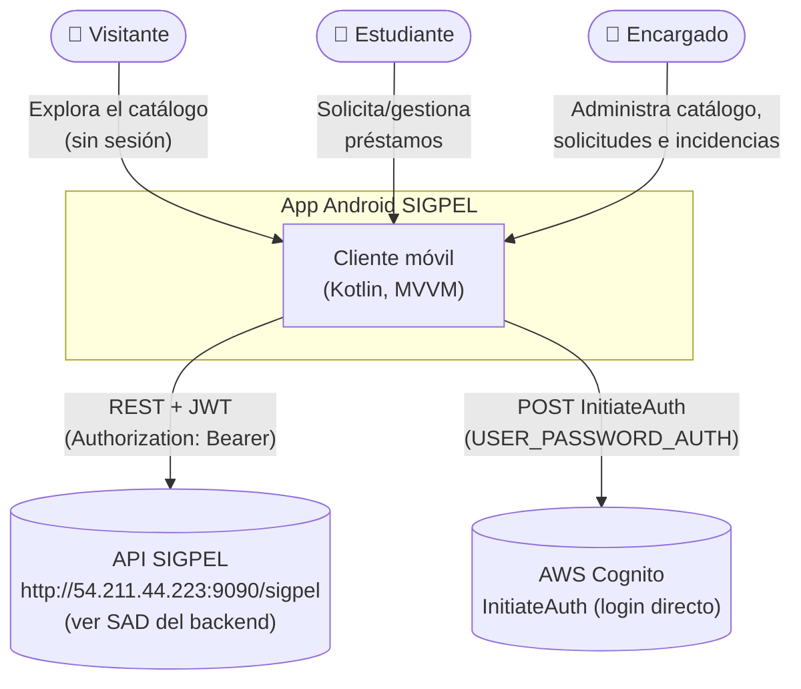
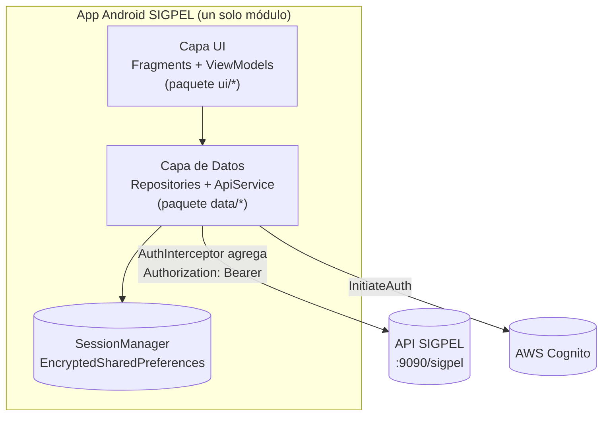
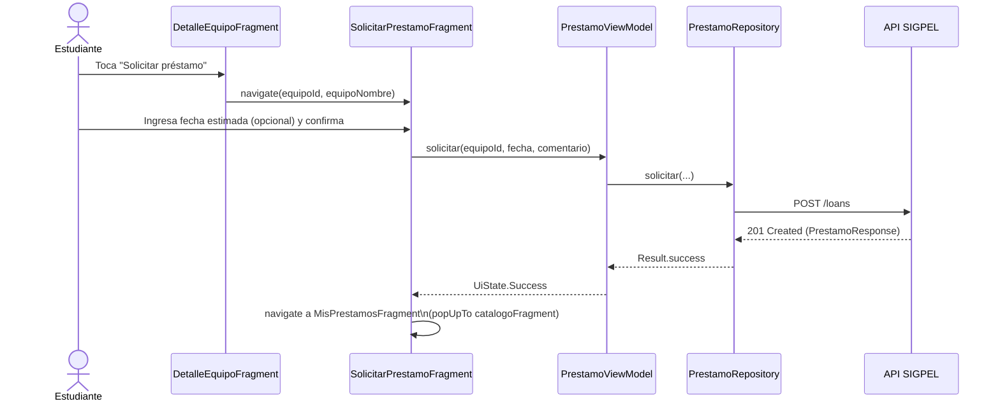
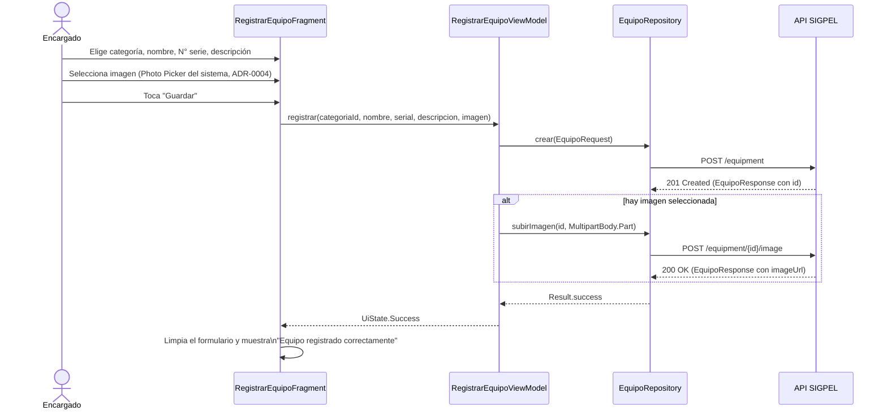
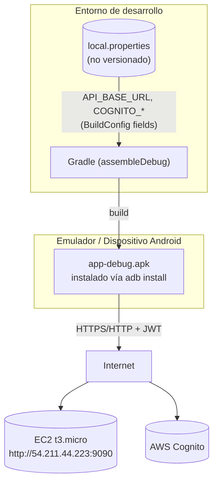

# Documento de Arquitectura de Software (SAD)

**Proyecto:** SIGPEL Móvil — Cliente Android del Sistema de Gestión de Préstamos de Equipos de Laboratorio
**Integrantes:** Jean Pierre Mora Santillán, Luis Mateo Rivera Escalante
**Curso / NRC:** Arquitectura Empresarial — 1473
**Periodo:** 2026-01
**Versión:** 1.0
**Fecha:** 2026-08-09
**Repositorio:** `Proyecto-Integrador-Mobile` (rama `develop`)
**Backend consumido:** `ae_2026_01_Mora_Rivera_1473` — `http://54.211.44.223:9090/sigpel/` (ver [SAD del backend](../../Backend/docs/SAD.md))

---

## 1. Introducción y Metas de Calidad

SIGPEL Móvil es el cliente Android nativo del sistema de préstamos de
equipos de laboratorio. Es una aplicación de un solo módulo (sin
back-for-frontend propio) que consume directamente la API REST del
backend `sigpel` y, para el inicio de sesión, la API pública de AWS
Cognito. No tiene lógica de negocio propia: valida formularios y decide
qué mostrar según el rol, pero toda regla de negocio (disponibilidad de
un equipo, quién puede cancelar un préstamo, unicidad del número de
serie, etc.) vive en el backend y se documenta en su propio SAD.

La app sirve a tres perfiles: **Visitante** (sin sesión, solo explora el
catálogo), **Estudiante** (solicita y gestiona sus propios préstamos) y
**Encargado** (administra categorías, equipos, solicitudes e
incidencias).

### Metas de calidad (priorizadas)

| # | Meta | Cómo se verifica |
|---|---|---|
| 1 | **Accesibilidad (WCAG AA)** — todo texto informativo debe tener un contraste de al menos 4.5:1 contra su fondo, y todo elemento táctil debe medir al menos 48dp con separación mínima entre elementos adyacentes. | Auditoría realizada con la skill `ui-ux-pro-max` (ver ADR y §9): color `text_secondary` (~6:1) reemplazando a `outline` (~1.7:1) como color de texto en 8 pantallas; badges de estado recalculados a ≥4.5:1; objetivos táctiles de `item_categoria.xml` llevados de 40dp a 48dp. |
| 2 | **Consistencia con el contrato del backend** — la app no debe romperse cuando el backend usa una convención de nombres distinta a la de la UI. | Todos los DTOs mapean el contrato en inglés del backend hacia propiedades/enums en español vía `@SerializedName` (ADR-0003), sin tocar la capa de presentación. |
| 3 | **Resiliencia ante errores de red** — ninguna pantalla debe quedarse en blanco o congelada si una petición falla; el usuario siempre ve un mensaje claro y una forma de reintentar. | Patrón uniforme `UiState<T>` (`Loading` / `Success` / `Error`) en cada ViewModel, con estado vacío/error dedicado en cada `RecyclerView` (`layout_empty`) y `SwipeRefreshLayout` para reintentar. |
| 4 | **Seguridad de la sesión** — el JWT de Cognito nunca debe quedar legible en el dispositivo. | `SessionManager` persiste el `idToken`/`accessToken` en `EncryptedSharedPreferences` (AES-256-GCM), nunca en `SharedPreferences` planas ni en logs. |
| 5 | **Adaptabilidad de pantalla** — la misma app debe verse utilizable tanto en teléfono como en tablet. | `layout-sw600dp/activity_main.xml` reemplaza el `BottomNavigationView` por un `NavigationRailView`; `content_max_width` limita el ancho de las tarjetas de formulario en pantallas grandes. |

---

## 2. Restricciones del Sistema

| Tipo | Restricción |
|---|---|
| **Técnica** | Lenguaje: Kotlin. Android `compileSdk`/`targetSdk` 34, `minSdk` 24. UI: Views + View Binding (sin Jetpack Compose, ADR-0002), Material Components 1.12, Navigation Component 2.8. Red: Retrofit 2.11 + OkHttp (interceptor de logging + de autenticación) + Gson. Concurrencia: Kotlin Coroutines. Sin framework de inyección de dependencias (ADR-0001). |
| **Negocio** | Proyecto académico de la asignatura Arquitectura Empresarial (NRC 1473, periodo 2026-01, PUCE); la app debe consumir la API del backend `sigpel` tal como está especificada, sin poder modificar su contrato salvo casos justificados y documentados (p. ej. se agregó `GET /incidents` al backend porque no existía ninguna forma de listar incidencias, ver `Backend/docs/adr`). |
| **Proceso** | Control de versiones Git; iteraciones tempranas con una rama `feature/HU-XX-...` y Pull Request por historia de usuario, iteraciones posteriores con commits directos a `develop`. Integración continua con GitHub Actions (`.github/workflows/tests.yml`) que ejecuta `./gradlew testDebugUnitTest` en cada push/PR a `main`/`develop`. |
| **Infraestructura** | Sin distribución en Google Play: se compila un APK de *debug* y se instala manualmente (`adb install`) en un emulador o dispositivo físico para pruebas. La URL del backend y las credenciales de Cognito (`API_BASE_URL`, `COGNITO_CLIENT_ID`, etc.) se inyectan en tiempo de compilación desde `local.properties` (no versionado), con un valor por defecto embebido en `build.gradle.kts` que apunta a la instancia EC2 del backend. |

---

## 3. Contexto y Alcance (C4 Model — Nivel 1)



**Actores:**
- **Visitante** — sin sesión iniciada; solo puede navegar el catálogo público de equipos y ver el detalle de cada uno.
- **Estudiante** — inicia sesión, solicita préstamos de equipos disponibles, consulta y cancela sus propios préstamos.
- **Encargado** — inicia sesión, administra categorías y equipos (incluida su foto), aprueba/rechaza/marca como devuelto un préstamo, y registra y gestiona incidencias.

**Sistemas externos:**
- **API SIGPEL** — el backend descrito en `Backend/docs/SAD.md`; único origen de datos de negocio de la app. La app nunca persiste datos de negocio localmente (sin caché offline, ver §9).
- **AWS Cognito** — la app llama directamente al endpoint público de Cognito (`InitiateAuth`, flujo `USER_PASSWORD_AUTH`) para el login, **sin pasar por el backend** (ver `CognitoAuthApi.kt`); el JWT resultante se reutiliza después en cada petición a la API SIGPEL.

---

## 4. Estrategia de la Solución

**Estilo arquitectónico:** MVVM (Model-View-ViewModel) de un solo módulo, con **Single Activity** (`MainActivity`) que aloja todas las pantallas como `Fragment`s dentro de un único `NavHostFragment` (Navigation Component). No hay separación en módulos Gradle (`:core`, `:data`, `:feature-x`, etc.): el tamaño del proyecto no lo justifica y habría añadido complejidad de build sin beneficio medible para un equipo de dos personas (ver ADR-0002).

**Justificación:**
- **MVVM sin framework de DI** — cada `Fragment` obtiene su `ViewModel` con una `ViewModelFactory` mínima (`simpleViewModelFactory`) que recibe las dependencias ya construidas por `SigpelApp` (contenedor manual de dependencias, un singleton por `Repository`). Se prefirió esto sobre Hilt/Koin porque el grafo de dependencias es plano (cada `Repository` solo depende de `ApiService`/`SessionManager`) y no justificaba la curva de aprendizaje ni el *boilerplate* de anotaciones de un framework de DI (ADR-0001).
- **Repositorios como única puerta de entrada a la red** — ningún `ViewModel` llama a `ApiService` directamente; siempre pasa por un `Repository` (`EquipoRepository`, `PrestamoRepository`, `CategoriaRepository`, `IncidenciaRepository`, `AuthRepository`) que envuelve la llamada en `runCatching` y devuelve `Result<T>`, centralizando el manejo de errores de red.
- **DTOs en español, contrato en inglés** — la UI y los `ViewModel` trabajan con nombres en español (`EquipoResponse.categoriaNombre`, `EstadoPrestamo.PENDIENTE`) mientras el JSON que viaja por la red usa los nombres en inglés que el backend expone (`categoryName`, `PENDING`), mapeados con `@SerializedName` (ADR-0003). Esto evita renombrar toda la capa de presentación cada vez que cambia un detalle del contrato del backend.

**Stack tecnológico principal:**

| Capa | Tecnología |
|---|---|
| Lenguaje / runtime | Kotlin, Android `minSdk` 24 / `targetSdk` 34 |
| UI | Android Views, View Binding, Material Components 1.12, Navigation Component 2.8 |
| Concurrencia | Kotlin Coroutines + `viewModelScope` |
| Red | Retrofit 2.11, OkHttp (interceptor de logging + `AuthInterceptor`), Gson (`@SerializedName`) |
| Sesión | `EncryptedSharedPreferences` (AndroidX Security Crypto) |
| Selección de imagen | Photo Picker del sistema (`ActivityResultContracts.PickVisualMedia`), ADR-0004 |
| Inyección de dependencias | Manual, vía `Application` (`SigpelApp`) — sin Hilt/Koin (ADR-0001) |
| CI | GitHub Actions (`testDebugUnitTest` en cada push/PR) |
| Pruebas | *(sin suite automatizada aún — ver §9, deuda técnica)* |

---

## 5. Vista de Bloques (C4 Model — Nivel 2 y 3)

### 5.1. Diagrama de Contenedores

Al ser una app de un solo módulo, el "contenedor" relevante en el
sentido de C4 es la app misma; el diagrama siguiente detalla sus capas
internas y hacia dónde salen sus llamadas de red.



### 5.2. Componentes y Capas

Estructura de paquetes real (`app/src/main/java/com/puce/sigpel`):

```
com.puce.sigpel
├── SigpelApp.kt              // Application: contenedor manual de dependencias
├── data
│   ├── auth/                 // SessionManager, JwtUtils, Role
│   ├── remote/                // ApiService (Retrofit), CognitoAuthApi, AuthInterceptor,
│   │   └── dto/               // NetworkModule; DTOs con @SerializedName (ADR-0003)
│   └── repository/            // AuthRepository, EquipoRepository, PrestamoRepository,
│                               // CategoriaRepository, IncidenciaRepository
├── ui
│   ├── main/                  // MainActivity (shell, toolbar, nav por rol)
│   ├── splash/                // SplashActivity
│   ├── auth/                  // LoginFragment, AuthViewModel
│   ├── catalogo/               // CatalogoFragment, DetalleEquipoFragment (público)
│   ├── prestamos/              // SolicitarPrestamoFragment, MisPrestamosFragment,
│   │                            // DetallePrestamoFragment (rol ESTUDIANTE)
│   ├── encargado/              // SolicitudesPendientesFragment, RegistrarEquipoFragment,
│   │                            // GestionCategoriasFragment, GestionEquiposFragment,
│   │                            // GestionIncidenciasFragment (rol ENCARGADO)
│   └── common/                 // EstadoBadge (bind + color por enum), ViewExt (setVisible,
│                                // textOrNull, toast, simpleViewModelFactory, sigpelApp)
└── util/                       // UiState<T>, DateFormat, Errors (toUserMessage)
```

- **Capa de Presentación (`ui/*`)** — cada pantalla es un `Fragment` con su
  `ViewModel` (LiveData de `UiState<T>`), su `ViewBinding` y, si lista
  datos, un `RecyclerView.Adapter` propio (`DiffUtil.ItemCallback`). Los
  `Fragment` no llaman a Retrofit directamente; solo observan el
  `ViewModel` y reaccionan a `UiState.Loading/Success/Error`.
- **Capa de Datos (`data/repository`)** — cada `Repository` expone
  funciones `suspend fun` que devuelven `Result<T>`, envolviendo la
  llamada Retrofit en `runCatching`. Es la única capa que conoce
  `ApiService`.
- **Capa de Red (`data/remote`)** — `ApiService` es la interfaz Retrofit
  con todos los endpoints consumidos; `AuthInterceptor` agrega el header
  `Authorization: Bearer <idToken>` a cada petición si hay sesión activa;
  `NetworkModule` construye el `OkHttpClient`/`Retrofit` una sola vez.
- **Capa de Sesión (`data/auth`)** — `SessionManager` persiste el JWT
  cifrado y el rol resuelto; `JwtUtils` decodifica el claim
  `cognito:groups` del `idToken` para derivar el `Role` sin depender de
  una llamada de red adicional.

---

## 6. Vista Dinámica (Comportamiento)

### Escenario 1: Solicitar un préstamo (Estudiante)



### Escenario 2: Registrar un equipo con imagen (Encargado)



---

## 7. Vista de Despliegue

A diferencia del backend, esta app no se "despliega" en un servidor: se
**compila e instala** en un emulador o dispositivo.



**Nodos:**
- **Entorno de desarrollo** — cualquier máquina con Android Studio/JDK y
  el Android SDK; `local.properties` (ignorado por Git, con
  `local.properties.example` como plantilla) provee `API_BASE_URL`,
  `COGNITO_REGION`, `COGNITO_USER_POOL_ID` y `COGNITO_CLIENT_ID`; si no
  están presentes, `build.gradle.kts` usa valores por defecto que apuntan
  a la instancia EC2 real del backend, para que el proyecto compile "de
  fábrica" sin configuración adicional.
- **Emulador / dispositivo Android** — corre el APK de *debug*, instalado
  manualmente con `adb install -r`. No hay *release build* firmado ni
  publicación en una tienda de aplicaciones (fuera del alcance
  académico).
- **EC2 / Cognito** — los mismos servicios gestionados descritos en el
  SAD del backend; la app los alcanza por HTTP/HTTPS público, sin ningún
  componente intermedio propio del cliente móvil.

**Build:** un único `Dockerfile`/pipeline no aplica aquí; el build es
`./gradlew assembleDebug` (local o en GitHub Actions, que además corre
`testDebugUnitTest`). No existe todavía un pipeline de distribución
(firma de *release*, subida a una tienda o a un servicio de distribución
interno) — ver deuda técnica en §9.

---

## 8. Decisiones Arquitectónicas (ADR)

| ADR | Título | Estado | Resumen |
|---|---|---|---|
| [0001](adr/0001-mvvm-sin-framework-di.md) | MVVM con inyección de dependencias manual (sin Hilt/Koin) | Aceptado | El grafo de dependencias es plano (cada Repository depende solo de `ApiService`/`SessionManager`); un contenedor manual en `SigpelApp` evita el *boilerplate* y la curva de aprendizaje de un framework de DI para un proyecto de este tamaño. |
| [0002](adr/0002-navigation-component-view-binding.md) | Single Activity + Navigation Component + View Binding, sin Jetpack Compose | Aceptado | Se prioriza consistencia con el estilo de Material Components clásico y menor riesgo de aprendizaje simultáneo (Compose + arquitectura + backend nuevo) para un equipo de dos personas con un cronograma académico fijo. |
| [0003](adr/0003-mapeo-contrato-ingles-via-serializedname.md) | DTOs en español mapeados al contrato en inglés del backend vía `@SerializedName` | Aceptado | Evita renombrar toda la capa de presentación (Fragments, layouts, strings) cada vez que el contrato del backend usa una convención distinta a la del dominio en español del enunciado del proyecto. |
| [0004](adr/0004-photo-picker-sistema.md) | Photo Picker del sistema para seleccionar la imagen de un equipo | Aceptado | El Photo Picker de Android (`ActivityResultContracts.PickVisualMedia`) no requiere declarar ni solicitar el permiso de galería en ninguna versión de Android soportada, a diferencia de `ACTION_GET_CONTENT` o el permiso `READ_MEDIA_IMAGES`. |

---

## 9. Riesgos Técnicos y Deuda Técnica

| # | Tipo | Descripción | Impacto / mitigación actual |
|---|---|---|---|
| 1 | Deuda técnica | **Sin suite de pruebas automatizadas** (`app/src/test` y `app/src/androidTest` están vacíos). El workflow de CI (`testDebugUnitTest`, `require_tests: false`) está listo para correrlas pero hoy no ejecuta ninguna. | Toda la verificación de este proyecto fue manual: compilación (`assembleDebug`) + instalación en emulador + inspección de `logcat`/capturas de pantalla en cada entrega. Alto riesgo de regresión silenciosa al modificar un `ViewModel` o `Adapter` sin que ningún test lo detecte. |
| 2 | Riesgo | **Sin renovación de token (refresh token).** El `idToken` de Cognito expira (1 hora, valor por defecto del User Pool); al expirar, la app no lo detecta proactivamente — la siguiente petición falla y el usuario debe iniciar sesión de nuevo manualmente. Se observó en vivo durante las pruebas de esta iteración (la sesión expiró a mitad de una prueba). | Sin mitigación automática; `AuthInterceptor` no reintenta con un `refreshToken`. Sería la primera mejora a implementar si el proyecto continuara. |
| 3 | Deuda técnica | **Inyección de dependencias 100% manual** (ADR-0001): funciona bien con ~5 repositorios, pero no escala si el número de pantallas/dependencias creciera significativamente — cada `ViewModelFactory` se repite manualmente en cada `Fragment`. | Aceptado conscientemente para el tamaño actual del proyecto. |
| 4 | Riesgo | **Sin caché ni modo offline.** Todas las pantallas dependen de una respuesta exitosa de la API en el momento; si la red falla, el usuario ve el estado de error (`UiState.Error`) pero no datos previamente cargados. | Mitigado parcialmente por `SwipeRefreshLayout` en cada lista (reintento manual de un toque) y mensajes de error uniformes vía `toUserMessage()`. |
| 5 | Deuda técnica | **Backend solo permite cambiar el `status` de un equipo, no editar sus demás campos** (`PATCH /equipment/{id}` acepta únicamente `EquipmentStatusRequest`). El ícono "editar" de `GestionEquiposFragment` abre por eso un diálogo de cambio de estado, no un formulario de edición completa (nombre, categoría, número de serie, descripción). | Documentado como limitación conocida; requeriría un nuevo endpoint en el backend (`PATCH` con el DTO completo) para resolverse. |
| 6 | Riesgo | **Pruebas de UI hechas por automatización de coordenadas de pantalla (ADB) durante el desarrollo son frágiles** ante cambios de layout — no es parte del producto final, pero explica por qué no hay pruebas instrumentadas (`androidTest`) con Espresso todavía: se priorizó el tiempo en verificación manual repetida sobre escribir una suite instrumentada nueva. | Riesgo de proceso, no de producto; se documenta para justificar la deuda técnica del punto 1. |
| 7 | Riesgo | **Distribución del APK 100% manual** (`adb install`), sin firma de *release* ni canal de distribución. | Aceptable para el alcance académico; fuera de alcance del proyecto actual. |

---

## Referencias

- Senn, J. A. (2004). *Análisis y Diseño de Sistemas de Información* (2ª ed.). McGraw-Hill. (Cohesión funcional y acoplamiento como criterios de diseño de capas.)
- [SAD del backend](../../Backend/docs/SAD.md) — arquitectura del sistema que esta app consume.
- [`SRS.md`](SRS.md) — requerimientos funcionales y no funcionales de este cliente móvil.
- [`casos-de-uso.md`](casos-de-uso.md) — especificación de casos de uso.
- [`sigpel_pantallas_moviles.md`](../../docs/sigpel_pantallas_moviles.md) — mapa de pantallas original que dio origen a este cliente.
