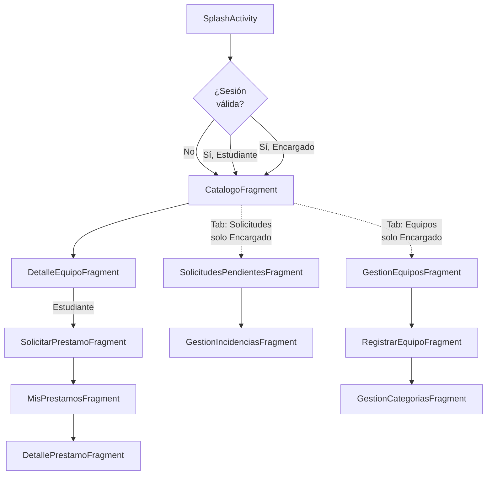
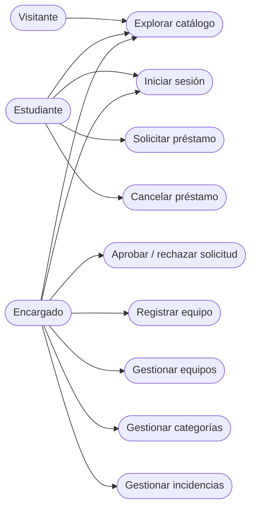

# Especificación de Requerimientos de Software (SRS)

**Estándar:** ISO/IEC/IEEE 29148
**Proyecto:** SIGPEL Móvil — Cliente Android
**Integrantes:** Jean Pierre Mora Santillán, Luis Mateo Rivera Escalante
**Curso / NRC:** Arquitectura Empresarial — 1473
**Versión:** 1.0 — 2026-08-09

> **Nota de alcance:** este documento especifica los requerimientos del
> **cliente móvil** (la app Android). Los requerimientos del backend que
> esta app consume (reglas de negocio, validaciones de servidor,
> persistencia) se especifican por separado en
> [`Backend/docs/SRS.md`](../../Backend/docs/SRS.md). Los identificadores
> `RF-XXX` de este documento son propios de este SRS y **no coinciden**
> numéricamente con los del backend, aunque varios requerimientos aquí
> descritos dependen de uno equivalente allá (se referencia explícitamente
> cuando aplica).

---

## 1. Introducción

### 1.1 Propósito

Especificar el comportamiento observable, las restricciones y los
atributos de calidad exigidos al cliente móvil de SIGPEL: qué pantallas
existen, qué puede hacer cada rol de usuario en cada una, y qué debe
garantizar la app independientemente de las reglas de negocio que ya
aplica el backend.

### 1.2 Alcance

La app cubre: exploración pública del catálogo de equipos, inicio de
sesión contra AWS Cognito, solicitud/consulta/cancelación de préstamos
(rol Estudiante), y administración de categorías, equipos, solicitudes
de préstamo e incidencias (rol Encargado).

**Queda fuera de alcance** de este cliente: cualquier persistencia local
de datos de negocio (no hay modo offline ni caché — ver §2.4), gestión de
perfil de usuario (el microservicio `users` del backend existe pero esta
app no tiene pantalla para consumirlo), y distribución en una tienda de
aplicaciones (solo APK de *debug* instalado manualmente).

### 1.3 Definiciones y Acrónimos

| Término | Significado |
|---|---|
| **JWT** | JSON Web Token; en este proyecto, el `idToken` emitido por AWS Cognito tras un login exitoso. |
| **UiState\<T\>** | Tipo sellado propio (`Loading` / `Success` / `Error`) que cada `ViewModel` expone para que el `Fragment` renderice un único estado de pantalla consistente. |
| **DTO** | Data Transfer Object; clase Kotlin que representa el cuerpo JSON de una petición/respuesta HTTP, con nombres en español mapeados al contrato en inglés del backend vía `@SerializedName`. |
| **Rol** | `VISITANTE` (sin sesión), `ESTUDIANTE` o `ENCARGADO`; se deriva del claim `cognito:groups` del JWT, nunca se elige manualmente en la app. |
| **Photo Picker** | Selector de imágenes del sistema operativo Android (`ActivityResultContracts.PickVisualMedia`), disponible sin permisos explícitos desde Android 11 en adelante y con *fallback* automático en versiones anteriores. |

### 1.4 Referencias

- Senn, J. A. (2004). *Análisis y Diseño de Sistemas de Información* (2ª ed.). McGraw-Hill.
- ISO/IEC/IEEE 29148:2018 — *Systems and software engineering — Life cycle processes — Requirements engineering.*
- WCAG 2.1 (Web Content Accessibility Guidelines) — criterios de contraste (1.4.3) y tamaño de objetivo táctil (2.5.5), usados como referencia para la Meta de calidad #1 del `SAD.md`.
- [`Backend/docs/SRS.md`](../../Backend/docs/SRS.md) — requerimientos del backend consumido.

---

## 2. Descripción General

### 2.1 Perspectiva del Producto

La app es un cliente delgado: no contiene reglas de negocio propias, solo
valida formularios en el cliente (campos requeridos, formato) como
mejora de experiencia antes de enviar la petición; la validación
autoritativa siempre ocurre en el backend. La app es reemplazable por
cualquier otro cliente (web, otra app móvil) sin que el backend deba
cambiar.

### 2.2 Funciones del Producto

| Función | Rol(es) |
|---|---|
| Explorar el catálogo público de equipos (buscar, filtrar por categoría) | Visitante, Estudiante, Encargado |
| Ver el detalle de un equipo | Visitante, Estudiante, Encargado |
| Iniciar / cerrar sesión | Estudiante, Encargado |
| Solicitar el préstamo de un equipo disponible | Estudiante |
| Consultar y cancelar los préstamos propios | Estudiante |
| Aprobar, rechazar o marcar como devuelto una solicitud de préstamo | Encargado |
| Registrar un equipo, con imagen opcional | Encargado |
| Gestionar equipos (listar, cambiar estado, eliminar) | Encargado |
| Gestionar categorías de equipo (crear, editar, eliminar) | Encargado |
| Registrar una incidencia sobre un préstamo devuelto | Encargado |
| Gestionar incidencias (listar, eliminar) | Encargado |

### 2.3 Características de los Usuarios

| Rol | Descripción | Requiere login |
|---|---|---|
| **Visitante** | Cualquier persona sin cuenta; explora el catálogo público. | No |
| **Estudiante** | Miembro de la comunidad PUCE con cuenta en el User Pool de Cognito, grupo `ESTUDIANTE`. | Sí |
| **Encargado** | Personal administrativo del laboratorio, grupo `ENCARGADO` en Cognito. | Sí |

### 2.4 Restricciones

- La app **no implementa modo offline**: cada pantalla depende de una
  respuesta exitosa de la API en el momento de mostrarse; no hay base de
  datos local (Room u otra) ni sincronización diferida.
- El **rol no es seleccionable en la app**: se deriva exclusivamente del
  claim `cognito:groups` del JWT devuelto por Cognito; la UI no tiene
  ningún mecanismo para que un usuario se autoasigne un rol distinto.
- El **backend limita qué puede editarse**: por ejemplo, un equipo solo
  puede cambiar de `status` vía API (no su nombre/categoría/descripción
  tras creado), por lo que la pantalla de gestión de equipos refleja esa
  misma limitación (ver `SAD.md` §9, riesgo #5).

### 2.5 Suposiciones y Dependencias

- Se asume que el dispositivo o emulador tiene conectividad a Internet
  hacia `54.211.44.223:9090` y hacia los endpoints públicos de AWS
  Cognito; sin ella, ninguna pantalla que dependa de red es funcional.
- Se asume que el User Pool de Cognito y sus grupos (`ESTUDIANTE`,
  `ENCARGADO`) ya existen y están poblados (dependencia del backend, no
  gestionada por esta app).
- Se asume Android 7.0 (`minSdk` 24) o superior en el dispositivo/emulador.

---

## 3. Requerimientos Específicos

### 3.1 Requerimientos Funcionales

#### Sesión y navegación por rol

| ID | Requerimiento |
|---|---|
| RF-001 | La app deberá permitir iniciar sesión con usuario y contraseña, autenticando directamente contra AWS Cognito (`InitiateAuth`, flujo `USER_PASSWORD_AUTH`), sin pasar por el backend `sigpel`. |
| RF-002 | La app deberá derivar el rol del usuario (`ESTUDIANTE` / `ENCARGADO`) del claim `cognito:groups` del `idToken` recibido, sin permitir su selección manual. |
| RF-003 | La app deberá persistir el `idToken` y el `accessToken` cifrados en el dispositivo (`EncryptedSharedPreferences`), de forma que la sesión sobreviva a un cierre y reapertura de la app. |
| RF-004 | La app deberá permitir cerrar sesión, borrando la sesión persistida y devolviendo la navegación a las pantallas disponibles para el rol Visitante. |
| RF-005 | La app deberá mostrar u ocultar cada pestaña de navegación (Catálogo, Mis Préstamos, Solicitudes, Equipos) y cada botón de acción según el rol actual, reevaluándolo en cada cambio de destino de navegación y en cada regreso a primer plano (`onResume`). |

#### Catálogo y detalle de equipo (público)

| ID | Requerimiento |
|---|---|
| RF-006 | La app deberá mostrar el catálogo de equipos sin requerir sesión iniciada. |
| RF-007 | La app deberá permitir buscar equipos por texto y filtrar por categoría mediante chips seleccionables. |
| RF-008 | La app deberá mostrar el detalle de un equipo (nombre, categoría, descripción, estado, imagen si existe) al seleccionarlo desde el catálogo. |
| RF-009 | La app deberá mostrar el botón "Solicitar préstamo" en el detalle de un equipo únicamente si hay una sesión de Estudiante activa. |

#### Préstamos (rol Estudiante)

| ID | Requerimiento |
|---|---|
| RF-010 | La app deberá permitir solicitar el préstamo de un equipo desde su pantalla de detalle, con fecha de devolución estimada opcional y comentario opcional. |
| RF-011 | La app deberá redirigir a la pantalla "Mis préstamos" tras una solicitud exitosa, limpiando la pila de navegación hasta el catálogo. |
| RF-012 | La app deberá listar únicamente los préstamos del Estudiante autenticado, ordenados por fecha de solicitud descendente, con un badge de color por estado (Pendiente/Aprobado/Rechazado/Devuelto). |
| RF-013 | La app deberá mostrar el botón "Cancelar solicitud" en el detalle de un préstamo únicamente si su estado es `PENDIENTE`, pidiendo confirmación antes de ejecutar la cancelación. |

#### Solicitudes de préstamo (rol Encargado)

| ID | Requerimiento |
|---|---|
| RF-014 | La app deberá listar todas las solicitudes de préstamo del sistema (no solo las propias) para el rol Encargado. |
| RF-015 | La app deberá permitir aprobar una solicitud pendiente con un toque, y rechazarla solicitando un comentario opcional en un diálogo. |
| RF-016 | La app deberá mostrar el botón "Marcar como devuelto" únicamente en solicitudes con estado `APROBADO`. |
| RF-017 | La app deberá mostrar el botón "Registrar incidencia" únicamente en solicitudes con estado `DEVUELTO`, abriendo un diálogo con tipo de incidencia y descripción. |

#### Gestión de equipos (rol Encargado)

| ID | Requerimiento |
|---|---|
| RF-018 | La app deberá permitir registrar un equipo nuevo indicando categoría (de una lista precargada), nombre, número de serie y descripción opcional, validando en el cliente que categoría, nombre y número de serie no estén vacíos antes de enviar la petición. |
| RF-019 | La app deberá permitir adjuntar una imagen al registrar un equipo, usando el Photo Picker del sistema, y subirla en una segunda petición tras crear el equipo si fue seleccionada. |
| RF-020 | La app deberá listar todos los equipos registrados para el rol Encargado, mostrando nombre, categoría, número de serie y estado. |
| RF-021 | La app deberá permitir cambiar el estado de un equipo (`Disponible` / `Prestado` / `Mantenimiento`) desde un diálogo de selección única, preseleccionando el estado actual. |
| RF-022 | La app deberá permitir eliminar un equipo, pidiendo confirmación previa. |

#### Gestión de categorías (rol Encargado)

| ID | Requerimiento |
|---|---|
| RF-023 | La app deberá permitir crear una categoría de equipo indicando únicamente su nombre. |
| RF-024 | La app deberá permitir editar el nombre de una categoría existente y eliminarla, en ambos casos pidiendo confirmación previa para eliminar. |

#### Gestión de incidencias (rol Encargado)

| ID | Requerimiento |
|---|---|
| RF-025 | La app deberá listar todas las incidencias registradas en el sistema, mostrando el préstamo asociado, tipo, descripción y fecha de reporte, ordenadas por fecha descendente. |
| RF-026 | La app deberá permitir eliminar una incidencia, pidiendo confirmación previa. |

### 3.2 Requerimientos de Interfaz Externa

**Interfaces de Usuario:** 11 pantallas (`Fragment`) alojadas en una
única `Activity` (`MainActivity`) con `BottomNavigationView` (teléfono) o
`NavigationRailView` (tablet, `layout-sw600dp`): Login, Catálogo, Detalle
de equipo, Solicitar préstamo, Mis préstamos, Detalle de préstamo,
Solicitudes pendientes, Registrar equipo, Gestión de categorías, Gestión
de equipos, Gestión de incidencias.

**Interfaces de Hardware:** cámara/galería del dispositivo, exclusivamente
a través del Photo Picker del sistema operativo (RF-019); ningún otro
periférico.

**Interfaces de Software:**
- **API SIGPEL** — REST/JSON sobre HTTP, autenticado con
  `Authorization: Bearer <idToken>` en cada petición (excepto las
  explícitamente públicas: catálogo y detalle de equipo).
- **AWS Cognito** — REST directo al endpoint `InitiateAuth` (sin el SDK
  completo de AWS, para no aumentar el tamaño del APK solo por el login).

### 3.3 Requerimientos No Funcionales (Atributos de Calidad)

| ID | Categoría | Requerimiento |
|---|---|---|
| RNF-01 | Accesibilidad | Todo texto informativo deberá tener un contraste de al menos 4.5:1 contra su fondo (WCAG 1.4.3). |
| RNF-02 | Accesibilidad | Todo elemento interactivo (botón, ícono de acción) deberá medir al menos 48×48dp, con al menos 4dp de separación respecto a otro elemento interactivo adyacente (WCAG 2.5.5). |
| RNF-03 | Seguridad | La app no deberá persistir el JWT ni ningún dato de sesión en texto plano; debe usar almacenamiento cifrado (`EncryptedSharedPreferences`). |
| RNF-04 | Resiliencia | Ninguna pantalla deberá quedar en blanco ante un error de red o del servidor; debe mostrar un mensaje de error legible y, si lista datos, permitir reintentar mediante deslizar-para-refrescar. |
| RNF-05 | Usabilidad | Toda lista vacía (sin resultados, no por error) deberá mostrar un estado vacío dedicado con ícono y mensaje explicativo, distinto del estado de error. |
| RNF-06 | Adaptabilidad | La app deberá ajustar su navegación principal (barra inferior vs. panel lateral) según el ancho de pantalla disponible, sin recompilar variantes separadas por dispositivo. |
| RNF-07 | Portabilidad | La app deberá compilar y ejecutarse sin configuración adicional (`local.properties` es opcional, con valores por defecto embebidos que apuntan al backend real). |
| RNF-08 | Mantenibilidad | Los DTOs deberán mapear el contrato en inglés del backend sin requerir cambios en la capa de presentación cuando el backend renombra un campo JSON, mientras el significado del campo no cambie. |
| RNF-09 *(brecha conocida)* | Confiabilidad | La app no detecta proactivamente la expiración del JWT; una petición con token expirado falla y exige un nuevo login manual, sin renovación automática. Documentado como riesgo abierto en `SAD.md` §9, no como requisito cumplido. |

### 3.4 Atributos del Sistema de Software

| Atributo | Meta | Estado medido |
|---|---|---|
| **Accesibilidad** | Contraste ≥4.5:1 en texto, objetivos táctiles ≥48dp. | Auditado y corregido con la skill `ui-ux-pro-max` en 8 pantallas + badges de estado + `item_categoria.xml` (ver `SAD.md` Meta de calidad #1). |
| **Resiliencia** | Ninguna pantalla en blanco ante error de red. | Patrón `UiState` verificado manualmente en las 11 pantallas (estado de error visible, sin *crash*). |
| **Seguridad de sesión** | Cero credenciales/tokens en texto plano. | `EncryptedSharedPreferences` (AES-256-GCM) en `SessionManager.kt`. |
| **Cobertura de pruebas automatizadas** | — *(sin meta cumplida)* | 0% — `app/src/test` y `app/src/androidTest` vacíos; verificación exclusivamente manual (ver `SAD.md` §9, deuda técnica #1). |

### 3.5 Requerimientos de Datos

#### 3.5.1 Modelo de Datos Local

La app no tiene base de datos local. El único dato persistido en el
dispositivo es la sesión, en `EncryptedSharedPreferences` (`SessionManager.kt`):

| Clave | Contenido |
|---|---|
| `id_token` | JWT (`idToken`) devuelto por Cognito; se envía como `Authorization: Bearer` en cada petición a la API SIGPEL. |
| `access_token` | JWT (`accessToken`) devuelto por Cognito; se persiste pero no se usa activamente en las peticiones actuales. |
| `username` | Nombre de usuario ingresado en el login, para mostrarlo en la UI si aplica. |
| `role` | `ESTUDIANTE` / `ENCARGADO`, derivado del claim `cognito:groups` en el momento del login (RF-002). |

Todos los demás datos (catálogo, préstamos, categorías, incidencias) se
piden a la API en el momento de mostrarse y **no se cachean**: cada
navegación a una pantalla de lista dispara una petición nueva.

#### 3.5.2 Integridad de Datos

Validaciones del lado del cliente (previas a la petición HTTP; la
validación autoritativa vive en el backend):
- Categoría, nombre y número de serie son obligatorios para registrar un
  equipo (RF-018); el nombre de categoría es obligatorio para
  crear/editar una categoría (RF-023, RF-024).
- El botón de acción de cada formulario permanece deshabilitado o
  muestra el error correspondiente (`text_feedback`) mientras la petición
  está en curso o si faltan campos requeridos.

#### 3.5.3 Retención de Datos

La sesión persiste hasta que el usuario cierra sesión explícitamente
(RF-004) o el JWT expira y una petición falla (ver RNF-09); no hay
retención de datos de negocio propios de la app más allá de la duración
de cada pantalla en memoria.

---

## 4. Modelos del Sistema

### 4.1 Flujo de Navegación por Rol

### 4.2 Diagrama de Casos de Uso (UML)

Ver el detalle de cada caso de uso en [`casos-de-uso.md`](casos-de-uso.md).

---

## 5. Matriz de Trazabilidad

| ID | Fuente | Prioridad | Estado | Ref. SAD | Artefacto | Verificación |
|---|---|---|---|---|---|---|
| RF-001 | HU-18 (Login) | Crítico | Verificado | SAD §3, §6 | `AuthRepository.kt`, `CognitoAuthApi.kt`, `LoginFragment.kt` | Prueba manual en emulador: login exitoso navega al catálogo con rol correcto. |
| RF-002 | HU-18 | Crítico | Verificado | SAD §5.2 | `JwtUtils.kt`, `SessionManager.role` | Prueba manual: cuenta `ENCARGADO` muestra pestañas de administración; `ESTUDIANTE` no. |
| RF-003 | HU-34 | Alto | Verificado | SAD Meta de calidad #4 | `SessionManager.kt` (`EncryptedSharedPreferences`) | Prueba manual: cerrar y reabrir la app conserva la sesión. |
| RF-004 | HU-34 | Alto | Verificado | SAD §5.2 | `MainActivity.onSessionActionClicked()` | Prueba manual: "Cerrar sesión" vuelve a mostrar solo el catálogo público. |
| RF-005 | HU-18 a HU-33 (acumulado) | Crítico | Verificado | SAD §5.2 | `MainActivity.refreshRoleUi()` | Prueba manual con las tres cuentas (visitante, estudiante, encargado). |
| RF-006 | HU-19 | Crítico | Verificado | SAD §5.2 | `CatalogoFragment.kt`, `CatalogoViewModel` | Prueba manual: catálogo visible sin iniciar sesión. |
| RF-007 | HU-19, HU-23 | Medio | Verificado | SAD §5.2 | `CatalogoFragment.kt` (buscador + chips) | Prueba manual. |
| RF-008 | HU-20 | Alto | Verificado | SAD §5.2 | `DetalleEquipoFragment.kt` | Prueba manual. |
| RF-009 | HU-20 | Medio | Verificado | SAD §5.2 | `DetalleEquipoFragment.kt` (visibilidad condicional) | Prueba manual con y sin sesión de Estudiante. |
| RF-010 | HU-20 | Crítico | Verificado | SAD §6 (Escenario 1) | `SolicitarPrestamoFragment.kt`, `PrestamoRepository.solicitar()` | Prueba manual + inspección de `logcat` (`POST /loans` → 201). |
| RF-011 | HU-20 | Medio | Verificado | SAD §6 (Escenario 1) | `nav_graph.xml` (`action_solicitarPrestamo_to_misPrestamos`) | Prueba manual. |
| RF-012 | HU-29 | Crítico | Verificado | SAD §5.2 | `MisPrestamosFragment.kt`, `MisPrestamosViewModel`, `PrestamoAdapter.kt` | Prueba manual: reimplementado en esta iteración tras detectar que la versión previa era un *stub*. |
| RF-013 | HU-30 | Alto | Verificado | SAD §5.2 | `DetallePrestamoFragment.kt`, `DetallePrestamoViewModel` (nuevo) | Prueba manual: botón visible solo en estado Pendiente; `DELETE /loans/{id}` confirmado en `logcat`. |
| RF-014 | HU-21 | Crítico | Verificado | SAD §5.2 | `SolicitudesPendientesFragment.kt`, `PrestamoAdminViewModel` | Prueba manual. |
| RF-015 | HU-21 | Crítico | Verificado | SAD §5.2 | `SolicitudAdapter.kt`, diálogo de rechazo (`DialogComentarioBinding`) | Prueba manual. |
| RF-016 | HU-32 | Alto | Verificado | SAD §5.2 | `SolicitudAdapter.kt` (`buttonDevuelto.setVisible`) | Prueba manual. |
| RF-017 | HU-33 | Medio | Verificado | SAD §5.2 | `SolicitudAdapter.kt`, `PrestamoAdminViewModel.registrarIncidencia()` | Prueba manual: `POST /incidents` → 201 confirmado en `logcat`, dos incidencias sobre el mismo préstamo. |
| RF-018 | HU-31 | Crítico | Verificado | SAD §6 (Escenario 2) | `RegistrarEquipoFragment.kt`, `RegistrarEquipoViewModel` (nuevo) | Prueba manual: 7 equipos reales registrados en producción durante esta iteración. |
| RF-019 | HU-31 | Alto | Verificado | SAD §6 (Escenario 2), ADR-0004 | `RegistrarEquipoFragment.imagenAMultipart()`, `EquipoRepository.subirImagen()` | Prueba manual (selección del Photo Picker confirmada; automatización completa del flujo de selección no lograda por limitaciones de la herramienta de pruebas, no de la app). |
| RF-020 | *(no cubierta por ninguna HU original — brecha detectada en esta iteración)* | Alto | Verificado | SAD §5.2 | `GestionEquiposFragment.kt`, `GestionEquiposViewModel` (nuevo) | Prueba manual: pantalla creada en esta iteración tras detectar que la especificación original (`sigpel_pantallas_moviles.md` §3.7) la pedía y no existía. |
| RF-021 | *(idem RF-020)* | Alto | Verificado | SAD §5.2 | `GestionEquiposFragment.showCambiarEstadoDialog()` | Prueba manual: cambio de estado confirmado con `PATCH /equipment/{id}` → 200 en `logcat`. |
| RF-022 | *(idem RF-020)* | Medio | Verificado | SAD §5.2 | `GestionEquiposViewModel.eliminar()` | Prueba manual (diálogo de confirmación verificado, eliminación no ejecutada para no perder datos de prueba reales). |
| RF-023 | HU-31 (extensión) | Alto | Verificado | SAD §5.2 | `GestionCategoriasFragment.kt`, `CategoriaFormDialogFragment.kt` | Prueba manual. |
| RF-024 | HU-31 (extensión) | Medio | Verificado | SAD §5.2 | `GestionCategoriasViewModel.editar()/eliminar()` | Prueba manual. |
| RF-025 | *(no cubierta por ninguna HU original — brecha detectada en esta iteración)* | Alto | Verificado | SAD §5.2 | `GestionIncidenciasFragment.kt`, `GestionIncidenciasViewModel` (nuevo) | Prueba manual contra producción: requirió agregar `GET /incidents` al backend (no existía), desplegarlo, y confirmar 2 incidencias reales listadas correctamente. |
| RF-026 | *(idem RF-025)* | Medio | Verificado | SAD §5.2 | `GestionIncidenciasViewModel.eliminar()` | Prueba manual (diálogo de confirmación verificado). |
| RNF-01 | Meta de calidad #1 del SAD | Alto | Verificado | SAD §1, §9 | `colors.xml` (`text_secondary`), 8 layouts corregidos | Auditoría `ui-ux-pro-max`: contraste calculado ~1.7:1 → ~6:1; badges de estado recalculados a ≥4.24:1 → ≥4.86:1. |
| RNF-02 | Meta de calidad #1 del SAD | Alto | Verificado | SAD §1, §9 | `item_categoria.xml` (40dp → 48dp, +4dp de margen) | Auditoría `ui-ux-pro-max` + verificación visual en emulador. |
| RNF-03 | Meta de calidad #4 del SAD | Crítico | Verificado | SAD §5.2 | `SessionManager.kt` | Revisión de código: `EncryptedSharedPreferences`, sin `SharedPreferences` planas para datos de sesión. |
| RNF-04 | Meta de calidad #3 del SAD | Alto | Verificado | SAD §5.2 | `UiState.kt`, patrón repetido en cada `ViewModel`/`Fragment` | Prueba manual: pantalla de Incidencias mostrando el estado de error correctamente contra un backend sin el endpoint aún desplegado. |
| RNF-05 | Meta de calidad #3 del SAD | Medio | Verificado | SAD §5.2 | `layout_empty` en cada `fragment_*.xml` con `RecyclerView` | Revisión de código y prueba manual. |
| RNF-06 | Meta de calidad #5 del SAD | Medio | Verificado | SAD §5.2 | `layout-sw600dp/activity_main.xml` | Revisión de código (no probado en un dispositivo tablet físico/emulador tablet en esta iteración). |
| RNF-07 | SAD §2 (restricción técnica) | Medio | Verificado | SAD §7 | `build.gradle.kts` (`localOrDefault`) | Revisión de código: valores por defecto embebidos y funcionales. |
| RNF-08 | ADR-0003 | Alto | Verificado | ADR-0003 | DTOs en `data/remote/dto/*.kt` | Revisión de código; verificado en producción con datos reales (categorías, equipos, préstamos, incidencias). |
| RNF-09 | Riesgo identificado por el equipo (no un requisito cumplido) | — | **No implementado** (brecha documentada) | SAD §9 (riesgo #2) | `AuthInterceptor.kt` (sin lógica de *refresh*) | N/A — observado en vivo: la sesión expiró durante las pruebas de esta iteración y exigió un nuevo login manual. |

---

## Notas de consistencia con otros documentos

- Los casos de uso de [`docs/casos-de-uso.md`](casos-de-uso.md)
  referencian los RF de este documento; a su vez, cuando un caso de uso
  depende de una regla de negocio del backend, referencia el `RF-XXX`
  correspondiente de [`Backend/docs/SRS.md`](../../Backend/docs/SRS.md)
  explícitamente (los dos conjuntos de identificadores son independientes
  entre sí).
- Las decisiones de arquitectura (ADR-0001 a 0004 de este repositorio) se
  referencian tanto desde los RF/RNF que las originaron como desde
  `SAD.md` §8.
- RF-020 a RF-022 y RF-025 a RF-026 documentan una brecha real detectada
  durante el desarrollo: la especificación original de pantallas
  (`sigpel_pantallas_moviles.md` §3.7 y §3.9) pedía una pantalla de
  gestión de equipos y una de gestión de incidencias que nunca se habían
  construido; se agregaron en esta iteración junto con el endpoint
  `GET /incidents` que faltaba en el backend.
